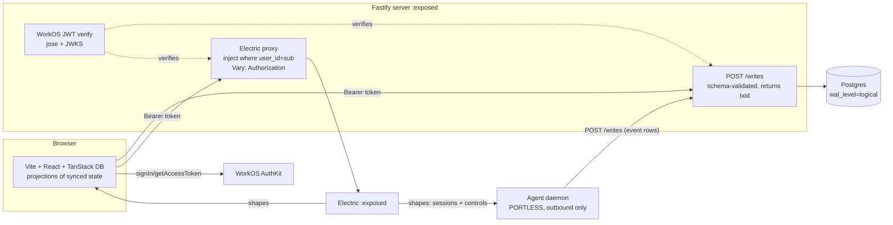

# feat: Steer — sync headless coding agent with live tool interception

## Summary

Build **Steer**: a sync-based headless coding agent (the HumanLayer take-home) plus a reactive web UI, sequenced **floor-first**. The floor (U1–U7) delivers the full required PRD spec — Postgres + Electric SQL + TanStack DB sync, a portless agent daemon, WorkOS auth, session CRUD, live viewing, interrupt/continue — and is an independently submittable, fully-tested cut. The headline (U8–U12) layers **live tool interception**: an operator swaps or edits a running agent's tool calls (read-only cancelled mid-execution, side-effecting approval-gated) with no extra inference, surfaced in a hybrid live-trace + PR-review UI with diffs. U13 hardens the evaluation surface (one-command cold-start, seed/Loom, CI at 100% coverage).

**ID convention for traceability:** origin requirement IDs are namespaced here as `INT-R#` (the interception requirements doc) and `UI-R#`/`UI-AE#` (the web-ui requirements doc), since both origin docs reuse the `R#` namespace.

---

## Problem Frame

The PRD mandates a sync-driven headless coding agent where every collection (sessions, events, tool calls, messages) reaches the UI through Electric SQL + TanStack DB, a portless agent daemon connects out only, and `docker compose up` stands the whole thing up with no extra steps. The strategy is to win on sync correctness, type-safety, and clean factoring, and to avoid the one fatal outcome — being the candidate who "couldn't follow the instructions." On top of that required floor, Steer's differentiator (the interception brainstorm) is letting an operator reach into a *running* tool call and redirect it; the UI brainstorm makes that graspable as a live trace with PR-review-style controls.

The build must therefore protect the required spec absolutely while making the headline genuinely demoable — and do both while holding a 100%-coverage test bar. Floor-first sequencing is the mechanism: U1–U7 is a complete, tested, PRD-compliant submission on its own; everything after is additive.

---

## Key Technical Decisions

- **Append-only event log as the one writable truth** (origin: ideation #1). One immutable `events` table; `messages`, `tool_calls`, and session `status` are projections/folds. The live stream, multi-window viewing, interrupt-audit, interception audit, and crash-only resume all derive from this. Rationale: makes "UI and agent are projections of synced state" literally true and the two-window demo trivially correct.
- **Single typed schema spine** (origin: ideation #6). `packages/schema` (drizzle + drizzle-zod) is the only place a type is authored — emitting Postgres DDL, Electric shape definitions, TanStack collection types, Fastify write-validation, Vercel AI-SDK tool I/O schemas, and React prop types. Rationale: turns end-to-end type-safety into a verifiable property; a generic write endpoint and `electricCollection<T>()` factory both fall out of it.
- **Electric is read-path only; writes go through a generic Fastify endpoint** (origin: ideation #1). Client → `POST /writes` → server writes Postgres (capturing `pg_current_xact_id()` **inside** the mutation tx) → Electric streams back. No websockets anywhere.
- **Security model = sync query** (origin: ideation #2). One Electric proxy verifies the WorkOS JWT and injects `where user_id = <sub>`; the client never authors a filter. `Vary: Authorization` prevents cache cross-user leaks; logout force-reloads to flush synced rows.
- **WorkOS AuthKit, bearer-token pattern** (research, 2026-06-02). For a Vite SPA + separate Fastify API, use `@workos-inc/authkit-react` (front end) + server-side JWT verification against the WorkOS JWKS via `jose`; the JWT `sub` claim is the per-user identity that scopes Electric. This differs from WorkOS's Next.js-first sealed-session docs and avoids cross-origin cookie complexity. Scaffolded with `npx workos@latest` after the UI shell exists.
- **Control-plane-via-data-plane** (origin: ideation #3, INT-R12). Interrupt, approve, reject, and tool-override are all rows written through the normal write path and synced into the portless agent — no second channel, no websocket.
- **Context as a projection of the event log** (origin: INT-R8, R9). After an override, the agent reconstructs its LLM context so the executed (substituted) tool appears as the call (+ a brief system note), so no extra "re-planning" inference fires and the prompt-cache prefix stays intact.
- **Hybrid interception** (origin: INT-R4). Proposal-gate/approval for side-effecting tools (the guaranteed floor, U8); live cancel-and-substitute for read-only tools (the reach, U10). Swap-eligible replacements are read-only only.
- **Side-effecting approval policy = explicit, no auto-timeout for v1** (resolves INT/UI deferred question). The approval gate is the whole point; a timeout would undermine it.
- **Diff source = agent emits before/after** (resolves UI-R21 deferred question). The `write_file` proposal event carries prior + proposed content so the client renders the diff directly.
- **Database: Postgres container, `DATABASE_URL`-configurable** (user decision, 2026-06-02). docker-compose ships a Postgres container so `docker compose up` is self-contained and PRD-compliant; `DATABASE_URL` can be repointed at Neon (`npx neonctl@latest init`) for an optional hosted demo. Neon is never required for the deliverable.
- **Server: Fastify; UI build: Vite; agent: Vercel AI SDK** (user decisions).
- **UI design system = the hi-fi handoff** (user-provided, 2026-06-02). The visual system — Solarized×mono tokens, type scale, spacing grid, tool-call status colors, per-component specs, icon set, and motion — is captured in `design-reference/DESIGN-SYSTEM.md` (extracted from `design-reference/interception-console/`). The web units (U6, U7, U11, U12) build to that spec. The handoff's assets (UMD React, in-browser Babel, plain CSS, `window.IC` mock + scripted engine) are **reference only and do not ship**; components are rebuilt typed in `apps/web`, tokens defined once as CSS custom properties / a typed theme, fonts self-hosted, icons as a typed component (or lucide-react).

---

## High-Level Technical Design

*This illustrates the intended approach and is directional guidance for review, not implementation specification. The implementing agent should treat it as context, not code to reproduce.*



**Event-log data model (directional):**

```
sessions(id, user_id, title, last_status, created_at)        -- last_status is a cached fold; truth is events
events(session_id, seq, type, payload jsonb, created_at)     -- append-only; seq monotonic per session
controls(id, session_id, type, payload jsonb, created_at, consumed_at)  -- interrupt | approve | reject | override

event.type ∈ { message, thinking, tool_proposed, tool_started, tool_stdout_delta,
               tool_result, tool_cancelled, tool_substituted, status_changed, interrupted }
control.type ∈ { interrupt, approve, reject, override }
override.payload = { target_tool_call, new_tool?, new_args? }   -- new_tool must be read-only
```

---

## Output Structure

```
steer/
├─ docker-compose.yml            # postgres (wal_level=logical) + electric + server + web + portless agent
├─ .env.example                  # all required vars; DATABASE_URL defaults to local PG container
├─ pnpm-workspace.yaml
├─ package.json
├─ README.md                     # clone + .env + `docker compose up`; Network-tab invite
├─ scripts/seed.ts               # cold-start proof = integration fixture = Loom script
├─ packages/
│  └─ schema/src/                # schema.ts, zod.ts, tools.ts (policy + tool I/O), index.ts (+ *.test.ts)
├─ apps/
│  ├─ server/src/                # app.ts, db.ts, migrate.ts, writes/ingest.ts, electric/proxy.ts, auth/workos.ts
│  ├─ web/src/                   # main.tsx, auth/, collections/factory.ts, components/, routes/ (+ e2e/)
│  └─ agent/src/                 # daemon.ts, loop.ts, context.ts, policy.ts, override.ts, resume.ts, tools/
└─ .github/workflows/ci.yml      # typecheck + vitest (100% thresholds) + playwright
```

The tree is a scope declaration; per-unit `**Files:**` are authoritative.

---

## Requirements Traceability

| Origin requirement(s) | Unit(s) |
|---|---|
| PRD docker-compose, ideation #5 cold-start | U1, U13 |
| ideation #1 event log, #6 schema spine; INT-R1,R11; UI-R12,R23 | U2 |
| ideation #1 write path, #2 secure-Electric; UI-R1,R23,R25 | U3 |
| PRD auth; UI-R1,R2,R3; ideation #2 | U4 |
| PRD agent + interrupt/continue; ideation #3,#7; UI-R11,R13,R28 | U5, U7 |
| UI-R4–R10,R25–R27; ideation #4 awaitTxId | U6 |
| UI-R11–R14,R23,R24 | U7 |
| INT-R1,R3,R4,R16; UI-R16 | U8 |
| INT-R5–R9,R11,R19,R20; UI-R17–R20 | U9 |
| INT-R2,R10; UI-R15 | U10 |
| UI-R15–R20; INT-R5–R7 | U11 |
| UI-R21,R22; INT-R21 | U12 |
| Success criteria, eval surface | U13 |

---

## Implementation Units

> **Execution posture (all feature-bearing units): test-first.** The user mandates 100% coverage with no compromise. Write the failing test for each unit's contract before implementation. Coverage thresholds are enforced in CI (U13). Pure-config/scaffolding files are excluded from coverage via explicit ignore and covered by boot/smoke checks instead.

### Phase A — Required PRD floor (independently submittable)

### U1. Monorepo scaffold + self-contained docker-compose
**Goal:** pnpm-workspace skeleton and a `docker compose up`-ready stack: Postgres (`wal_level=logical`, `pg_isready` healthcheck), Electric (`depends_on: condition: service_healthy`), server, web, and a **portless** agent container; a migrate step that runs before the app boots; `.env.example` mapping 1:1 to required vars.
**Requirements:** PRD docker-compose; ideation #5.
**Dependencies:** none.
**Files:** `docker-compose.yml`, `.env.example`, `pnpm-workspace.yaml`, `package.json`, `apps/*/Dockerfile`.
**Approach:** Postgres 16 with `command: postgres -c wal_level=logical -c max_replication_slots=10`; Electric gated on PG health; agent service has **no `ports:`**; `DATABASE_URL` defaults to the local PG container and is overridable (Neon). A one-shot migrate container runs drizzle migrate and exits 0 before server/agent start.
**Patterns to follow:** Electric install/deployment compose guidance from the ideation external-research section (`wal_level=logical`, `condition: service_healthy`, `/v1/health`).
**Test scenarios:** `Test expectation: none -- infra scaffolding`, covered by a CI boot smoke check: stack reaches healthy, Electric `/v1/health` returns 200, and the agent container exposes no published ports.
**Verification:** clean-machine `docker compose up` brings all services healthy with only `.env` set.

### U2. Typed schema spine (drizzle + drizzle-zod)
**Goal:** the single source of truth: `sessions`, append-only `events`, `controls`; drizzle-zod row schemas; tool I/O + policy schemas; migrations.
**Requirements:** ideation #1, #6; INT-R1, R11; UI-R12, R23.
**Dependencies:** U1.
**Files:** `packages/schema/src/schema.ts`, `packages/schema/src/zod.ts`, `packages/schema/src/tools.ts`, `packages/schema/src/index.ts`, `packages/schema/src/*.test.ts`, `packages/schema/migrations/`.
**Approach:** model the event log + control tables per the data-model sketch; derive zod via drizzle-zod; define tool arg/result schemas and a policy map (`read_file`/`list_dir`/`grep`/`web_fetch` = read-only; `write_file`/`bash` = side-effecting); export shape + collection types.
**Test scenarios:** zod round-trip per table row (valid + invalid payload rejected); `seq` monotonicity enforced; each tool's arg schema validates valid input and rejects malformed; `policy.classify(tool)` returns the correct class for every known tool and a safe default for unknown; event/control `type` enums reject unknown values.
**Verification:** types compile; `grep -r ": any"` in `packages/schema` is empty; migrations apply cleanly.

### U3. Server — generic write API (txid) + Electric auth proxy
**Goal:** Fastify server exposing (a) `POST /writes` (schema-validated, returns the pg txid captured inside the mutation tx) and (b) an Electric proxy that verifies auth, injects `where user_id = sub`, sets `Vary: Authorization`, and forwards to Electric.
**Requirements:** ideation #1 write path, #2; INT-R12; UI-R1, R23, R25.
**Dependencies:** U2 (and U4 for the verify hook).
**Files:** `apps/server/src/app.ts`, `apps/server/src/writes/ingest.ts`, `apps/server/src/electric/proxy.ts`, `apps/server/src/db.ts`, `apps/server/src/*.test.ts`.
**Approach:** `/writes` validates `{collection, op, payload}` against the schema registry, injects the authenticated `user_id` (ignoring any client-supplied value), runs the mutation and `pg_current_xact_id()` in **one** transaction, returns `{txid}`. The proxy injects the WHERE clause server-side and never trusts a client filter.
**Patterns to follow:** Electric Proxy-Auth + `Vary: Authorization` from the ideation external-research section; txid-inside-tx from the awaitTxId research.
**Test scenarios (integration against real Postgres):** write returns a txid that resolves via the sync stream (no stall); write injects authed `user_id` and ignores a client-supplied one; invalid payload → 400; proxy rejects unauthenticated → 401; **Covers UI-AE1** — user A cannot read user B's rows through the proxy; `Vary: Authorization` present on shape responses; client-supplied `where` is ignored.
**Verification:** cross-user isolation holds; writes reconcile without stalling.

### U4. WorkOS auth — SPA bearer + server JWT verification
**Goal:** AuthKit login on the SPA issuing bearer tokens; Fastify verification of the WorkOS JWT (JWKS via `jose`) exposing `sub` as the request identity that U3 scopes on; logout flushes synced state.
**Requirements:** PRD auth; UI-R1, R2, R3; ideation #2.
**Dependencies:** U3; **scaffold via `npx workos@latest` after U6's UI shell exists.**
**Files:** `apps/server/src/auth/workos.ts`, `apps/web/src/auth/` (`AuthKitProvider`, `useAuth`, token attach), `apps/server/src/auth/*.test.ts`, `apps/web/src/auth/*.test.ts`.
**Approach:** FE `@workos-inc/authkit-react`; `getAccessToken()` → `Authorization: Bearer` on every API/sync request (call fresh before opening sync). BE verifies via `createRemoteJWKSet` against `https://api.workos.com/sso/jwks/<client_id>`, extracts `sub`. Logout: `signOut({ returnTo })` + force reload. No server `/callback` route (the SDK handles the code exchange).
**Test scenarios:** valid token → `request.user.sub` set; expired → 401; forged signature → 401; missing header → 401; JWKS fetched once and cached (assert no per-request refetch); **Covers UI-AE1** — logout clears the token and triggers a reload that flushes synced rows.
**Verification:** only authenticated requests reach data; `sub` scopes the proxy.

### U5. Agent daemon — loop, tools, event emission, interrupt, crash-only resume
**Goal:** portless daemon that subscribes to its sessions + controls via Electric, runs the Vercel AI SDK loop with tools, appends every step as an event row through `/writes`, halts on interrupt controls, and resumes from `MAX(seq)` on restart.
**Requirements:** PRD agent + interrupt/continue; ideation #3, #7; UI-R11, R13, R28.
**Dependencies:** U2, U3.
**Files:** `apps/agent/src/daemon.ts`, `apps/agent/src/loop.ts`, `apps/agent/src/resume.ts`, `apps/agent/src/tools/`, `apps/agent/src/*.test.ts`.
**Approach:** subscribe to a sessions+controls shape; for a new session run `streamText` with tools and `stopWhen(stepCountIs(n))`; `onStepFinish` appends event rows; between steps check unconsumed controls → on interrupt append `interrupted` and stop. On boot, for in-flight sessions read `MAX(seq)`, rebuild context via projection, continue. Outbound only.
**Execution note:** test-first with the Vercel AI SDK mock model (`simulateReadableStream`) for a deterministic loop.
**Test scenarios:** scripted run emits ordered event rows (message → tool_proposed → tool_result → message); interrupt control halts at the next boundary + appends `interrupted`; resume reads `MAX(seq)` and does **not** re-run committed steps (idempotent); `read_file`/`list_dir` happy + missing-file error; `bash` captures stdout; **integration** — inserting a session row causes the daemon to pick it up.
**Verification:** `docker kill` mid-run + restart resumes from the last step; interrupt stops within one step.

### U6. UI shell + session sidebar (CRUD/search) + optimistic awaitTxId
**Goal:** Vite+React two-pane shell behind the login gate; sidebar lists the user's sessions with search/status-filter and create/rename/delete via a `electricCollection<T>()` factory with `awaitTxId` reconciliation; deep-linkable sessions; empty/loading/error states.
**Requirements:** UI-R4–R10, R25–R27; ideation #4.
**Dependencies:** U3, U4.
**Files:** `apps/web/src/main.tsx`, `apps/web/src/collections/factory.ts`, `apps/web/src/components/{Shell,Sidebar,NewSessionForm}.tsx`, `apps/web/src/**/*.test.ts(x)`, `apps/web/e2e/sessions.spec.ts`.
**Approach:** the factory wires the shape URL (via proxy), parser, write handler (`POST /writes`), and `awaitTxId` (txid from the write response) — capturing the documented footgun in one place. Sidebar = `useLiveQuery`; search/filter client-side; optimistic create/rename/delete; routing reflects the open session.
**Execution note:** test-first on the factory + `awaitTxId` helper.
**Test scenarios:** `awaitTxId` resolves when the matching txid arrives and times out (not hangs forever) on mismatch — regression for txid-inside-tx; optimistic create shows immediately then reconciles; rename persists; **Covers UI-AE6** — delete confirms then removes and stays gone after sync; **Covers UI-AE2** — search narrows the list live; deep-link opens the right session; empty/loading/error states render.
**Verification:** sidebar reflects synced truth with no flicker; deep links work.

### U7. Live session trace view + interrupt/continue controls
**Goal:** detail pane renders the synced event log as a live trace (messages, thinking, tool-call cards with streaming results), a status indicator, auto-follow with scroll-back, and interrupt/continue controls that write control rows.
**Requirements:** UI-R11–R14, R23, R24, R28.
**Dependencies:** U5, U6.
**Files:** `apps/web/src/components/{SessionView,TraceList,ToolCard,StatusBadge}.tsx`, tests, `apps/web/e2e/live-trace.spec.ts`.
**Approach:** `useLiveQuery` over the events collection; render by type; tool cards show name/args/status/result; auto-follow newest with a "jump to live" affordance when scrolled up; interrupt/continue write controls; status derived from events (cached `last_status` for sidebar perf).
**Test scenarios:** trace appends new events live; tool card reflects status transitions (proposed → running → done); thinking/message render; auto-follow + scroll-back; interrupt writes a control and status → interrupted; continue resumes; **Covers UI-AE5** (E2E two-window) — an event in window A appears in window B with no refresh.
**Verification:** live trace streams; two-window consistency; interrupt/continue operable. *(Floor complete — U1–U7 is the full required PRD spec.)*

### Phase B — Live tool interception (headline backend)

### U8. Tool policy + proposal-gate (approach A floor)
**Goal:** side-effecting tools enter a pending/approval state and do not execute until approved; read-only tools run immediately. A guaranteed interception window for all tools.
**Requirements:** INT-R1, R3, R4, R16; UI-R16.
**Dependencies:** U5.
**Files:** `apps/agent/src/policy.ts`, `apps/agent/src/loop.ts`, tests.
**Approach:** before a side-effecting tool, append `tool_proposed`(pending) and wait for an `approve`/`reject`/`override` control (v1: explicit approval, no timeout). Read-only proceeds (cancellable in U10).
**Test scenarios:** **Covers UI-AE4 (backend)** — `write_file` waits at the gate with no execution until an approve control; read-only executes without gating; approve → executes; reject → not executed + `tool_cancelled` event; unknown tool defaults to the safe (gated) class.
**Verification:** no side-effecting tool runs without passing the gate.

### U9. Override engine + context projection + audit
**Goal:** apply operator overrides (substitute read-only tool, edit args, approve, reject) at the tool boundary; record proposed + override + executed immutably; reconstruct LLM context so the executed (substituted) call appears as the call (+ system note), with no extra inference.
**Requirements:** INT-R5–R9, R11, R19, R20; UI-R17–R20.
**Dependencies:** U8.
**Files:** `apps/agent/src/override.ts`, `apps/agent/src/context.ts`, `apps/agent/src/loop.ts`, tests.
**Approach:** on an `override` control, validate any substitute tool is read-only, run the substituted/edited tool, append `tool_substituted` + `tool_result`, retain the original `tool_proposed` as audit; `context.ts` builds messages from the event log projecting the executed call as the assistant tool call + result, adding a system note on substitution. No extra LLM turn beyond the normal next step.
**Execution note:** test-first on the context projection (the "no extra inference" contract).
**Test scenarios:** **Covers INT-AE1** — substitute `grep`→`read` runs `read`, appends substituted + result, retains the original proposed (audit); edit-args runs the tool with new args; substitute to a side-effecting tool is rejected (read-only only); projection shows the executed tool as *the* call with no duplicate/extra turn; system note present on substitution; the next inference consumes the substituted result with exactly one subsequent turn (assert no re-plan detour).
**Verification:** swaps produce a coherent, audited continuation with no extra inference.

### U10. Live mid-execution cancel-and-substitute (read-only, approach B reach)
**Goal:** read-only tools run under a cancellable wrapper observing override/cancel controls; the operator cancels an in-flight read-only tool, partial output is discarded, and the substitute runs. Enabled for at least one read-only tool.
**Requirements:** INT-R2, R10; UI-R15.
**Dependencies:** U9.
**Files:** `apps/agent/src/tools/` (cancellable wrappers), `apps/agent/src/loop.ts`, tests.
**Approach:** wrap read-only execution in an `AbortController` fed by a control subscription; on cancel, abort + discard partial output, then run the substitute via U9; for child-process tools (`grep`), kill the process. Handle the race where the tool finishes before the cancel lands (treat as completed; override no-ops with a notice).
**Execution note:** test-first on cancellation, partial-discard, and the race.
**Test scenarios:** cancel in-flight read-only tool → aborted and partial output **not** persisted as the result (INT-R10); substitute runs after cancel; race — tool completes before cancel → result kept, override no-ops; child process killed on cancel (no orphan).
**Verification:** in the demo, a running `grep` is cancelled and swapped to `read`, and the run continues.

### Phase C — Interception UI

### U11. Interception controls + swap picker + arg editor
**Goal:** tool cards expose the interception controls (read-only: Cancel & swap / Edit args / Cancel; side-effecting pending: Approve / Swap / Edit args / Reject); the swap picker lists only read-only tools; the arg editor edits args; actions write control rows; the card shows the audit after an override.
**Requirements:** UI-R15–R20; INT-R5–R7.
**Dependencies:** U7, U8, U9, U10.
**Files:** `apps/web/src/components/{InterceptPanel,SwapPicker,ArgEditor}.tsx`, tests, `apps/web/e2e/interception.spec.ts`.
**Approach:** ToolCard renders the control set by status + policy; Swap opens a picker populated from the read-only policy set; Edit args opens a form validated against the tool's zod schema; actions POST control rows optimistically; after override the card shows the executed tool + audit ("operator substituted grep → read").
**Test scenarios:** read-only running card shows cancel&swap/edit/cancel; side-effecting pending shows approve/swap/edit/reject; **Covers UI-AE3** — the swap picker offers only read-only tools and swapping a running `grep`→`read` works end to end; edit-args validates against the tool schema (invalid rejected); actions write control rows; audit displays after override; **Covers UI-AE4 (E2E)** — approve a `write_file` shown with a diff.
**Verification:** full interception is operable from the UI; only read-only tools are offered as swaps.

### U12. Diff rendering for file-writing tools
**Goal:** file-writing tool proposals render a diff inside the card; approval acts on exactly what the diff shows; non-file results render as text/structured output.
**Requirements:** UI-R21, R22; INT-R21.
**Dependencies:** U11; the agent's `write_file` proposal emits before/after content.
**Files:** `apps/web/src/components/DiffView.tsx`, `apps/agent/src/tools/write_file.ts` (emit before/after), tests.
**Approach:** the `write_file` `tool_proposed` event carries prior + proposed content; `DiffView` renders added/removed lines; non-file results render as text/JSON.
**Test scenarios:** **Covers UI-AE4** — diff renders added/removed for a write proposal and approval writes exactly the shown content; non-file tool result renders as text, not a diff (UI-R22); new-file diff renders as all-added.
**Verification:** the reviewer sees the change before approving.

### Phase D — Evaluation surface

### U13. Seed + two-window demo + README + compose finalize + 100% CI gate
**Goal:** one `seed.ts` that triples as cold-start proof, integration fixture, and Loom script; finalized compose healthcheck ordering; a README whose first block is clone + `.env` + `docker compose up` (with a Network-tab invite); CI enforcing typecheck + 100% coverage + the two-window E2E.
**Requirements:** ideation #5; PRD README/Loom; success criteria.
**Dependencies:** all prior.
**Files:** `scripts/seed.ts`, `README.md`, `.github/workflows/ci.yml`, `vitest.config.ts` (coverage thresholds), `playwright.config.ts`.
**Approach:** deterministic seed (demo user + scripted session that lands in a working two-window state); finalize `depends_on: condition: service_healthy`; README documents `.env` and the one command; CI runs `vitest --coverage` at 100% thresholds + Playwright. The seed walkthrough is the Loom script.
**Test scenarios:** seed is idempotent and produces a working two-window state; CI fails if coverage < 100% or any `: any` is present; **Covers UI-AE5 (E2E)** — two-window live sync; cold-start boot health passes on a clean machine.
**Verification:** fresh clone + `.env` + `docker compose up` → working seeded demo; CI green at 100% coverage.

---

## Build Order

The groups are sequenced by dependency, each building on a complete, tested predecessor, so the work stays in a shippable state throughout.

- **Phase A (U1–U7) — the floor.** A complete, PRD-compliant, fully-tested submission on its own: sync substrate, auth, agent daemon, session CRUD, live viewing, interrupt/continue, `docker compose up`. It is the guaranteed deliverable and stands alone.
- **Phase B (U8–U10) — interception backend.** The headline mechanism.
- **Phase C (U11–U12) — interception UI.** Makes the headline demoable (swap + diffs).
- **Phase D (U13) — eval surface.** Hardens the floor with seed, README, and the 100% CI gate.

Because every phase rests on a working, tested floor, the project is always in a coherent, submittable state and the headline is purely additive on top of it.

---

## Risk Analysis & Mitigation

- **100% coverage across the full scope.** *Mitigation:* floor-first — U1–U7 is the tested, submittable cut; B/C/D are additive. Honor the bar within whatever scope ships rather than shipping untested breadth.
- **`awaitTxId` footgun (txid taken outside the tx → permanent stall).** *Mitigation:* one centralized write helper (U3) + one collection factory (U6), each with a regression test asserting resolve-on-match and timeout-on-mismatch.
- **Mid-execution cancellation races (U10).** *Mitigation:* read-only-only swap universe (no rollback), explicit race test, and a no-op-on-late-cancel path.
- **WorkOS SPA bearer pattern diverges from the Next.js-first docs.** *Mitigation:* grounded in research; scaffold via `npx workos@latest` after the UI exists; no server `/callback` route.
- **Electric public-by-default / cross-user leak.** *Mitigation:* single proxy with server-injected WHERE + `Vary: Authorization` + force-reload-on-logout, with a cross-user isolation test (U3).
- **PRD compliance.** *Mitigation:* Postgres container retained in compose; agent container portless; `docker compose up` self-contained; Neon strictly optional via `DATABASE_URL`.

---

## Testing Strategy

- **Framework:** Vitest (unit + integration) across all packages/apps; coverage thresholds set to 100% (lines/branches/functions/statements) and enforced in CI (U13). Non-feature scaffolding/config is excluded via explicit coverage ignore and covered by boot/smoke checks.
- **Server:** Fastify `inject` for HTTP; write-path and proxy tests run against a real Postgres (compose service or testcontainers) so txid and WHERE-injection are proven, not mocked.
- **Agent:** Vercel AI SDK mock model (`simulateReadableStream`) for deterministic loop/override/resume tests; real child processes for tool-cancellation tests.
- **Auth:** `jose` verified against a test JWKS (valid/expired/forged).
- **Web:** component tests for collections/cards/diff; **Playwright E2E** for the two-window live-sync and interception flows (the AE-covered scenarios).
- **AE coverage:** every origin Acceptance Example is enforced by a `Covers AE#`-tagged test (see per-unit scenarios).

---

## Dependencies / Prerequisites

- **Env (`.env`):** `DATABASE_URL` (defaults to local PG; override for Neon), `ELECTRIC_URL`, `WORKOS_API_KEY`, `WORKOS_CLIENT_ID`, `VITE_WORKOS_CLIENT_ID`, `VITE_WORKOS_REDIRECT_URI`, an LLM provider key (e.g. `ANTHROPIC_API_KEY`).
- **Tooling:** pnpm; Docker; `npx workos@latest` (auth scaffold, after U6); `npx neonctl@latest init` (optional, only for a hosted Neon demo).
- **WorkOS dashboard:** register the redirect URI matching `VITE_WORKOS_REDIRECT_URI`; set a sign-out redirect.
- **Design reference:** `design-reference/DESIGN-SYSTEM.md` (visual source of truth for U6/U7/U11/U12) + the raw handoff under `design-reference/interception-console/` (reference only — do not ship). Self-host JetBrains Mono.

---

## Deferred to Implementation

- Exact cancellation mechanics per read-only tool (AbortSignal vs `child_process.kill`) — settle when wiring U10's real processes.
- Final `seq` allocation mechanism (DB sequence per session vs computed `MAX(seq)+1` under contention) — decide against real concurrency in U2/U5.
- Auto-follow vs scroll-lock interaction details for very long traces (UI-R14) — default to auto-follow + jump-to-live; tune in U7.
- Whether `sessions.last_status` is a trigger-maintained cache or updated by the agent on each event — decide in U2/U5.

---

## Scope Boundaries

**Carried from origin (out of scope):**
- Divergent persisted parallel branches / true A/B forking; replay/time-travel scrubber.
- Workspace/file-tree browser (diffs come from write events only).
- Mid-execution cancel/rollback of side-effecting tools (approval-gate instead).
- Substituting *to* a side-effecting tool (read-only replacements only).
- Auth beyond WorkOS login/logout (no signup/profile/settings); no multi-user collaboration/sharing/presence; no mobile-optimized layout.
- Full-text in-session event search (session-list search only).

### Deferred to Follow-Up Work
- Heartbeat/liveness indicator and idempotency keys (ideation rejections #4, #5) — additive hardening, not needed for the demo.
- Neon as the primary host (kept behind `DATABASE_URL`; not wired into the deliverable's compose).

---

## Success Criteria

- Fresh clone + `.env` + `docker compose up` stands up the whole stack on a clean machine with no extra steps; the agent container exposes no ports.
- A reviewer can sign in, create/find a session, watch the agent work live, interrupt/continue it, and — for the headline — swap a running read-only tool and approve/amend a file write (with diff), live, reflected across two windows.
- All PRD-required capabilities pass; CI is green at 100% coverage with no `: any`.
- Every origin Acceptance Example is enforced by a tagged test.
