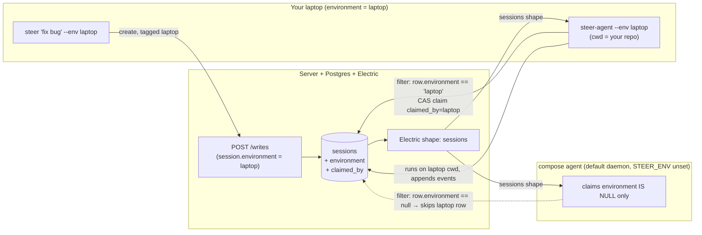

# feat: Environment-bound sessions ("run it anywhere" for real)

## Summary

The PRD says the agent daemon "should be able to run **anywhere** that can connect
out to the server — on a workstation, sandbox, container, etc." (§3a) and "runs
the sessions **on the host it's running on**" (§3e). Today Steer half-implements
this: the daemon correctly operates on its own cwd
(`apps/agent/src/workspace.ts` → `resolveWorkspaceRoot`), but **nothing routes a
session to a particular environment**. `apps/agent/src/index.ts` subscribes to the
*entire* `sessions` shape with no filter, and the only guard against double-running
is an in-process `Set` (`apps/agent/src/daemon.ts:18`). The consequence:

1. The moment a **second** daemon exists (your laptop *and* the compose `agent`
   container), both race to claim every runnable session — there is no binding to
   the *right* filesystem.
2. In the shipped `docker compose up`, the lone agent container's cwd is `/app`, so
   a session you start "from your laptop" actually executes against the
   **container's** files, silently contradicting "runs on the host it's running on."
3. "View it and send another prompt → same filesystem" works today only because
   there happens to be one daemon. It is emergent, not designed.

This plan adds the missing primitive — **a session is bound to exactly one
environment, and exactly one daemon claims it** — at the *minimal* depth confirmed
with the user (not first-class configured-environment objects). It also adds a
**local-daemon run path** so "start a session in my local environment → it uses my
laptop's files → I view it and steer it from any client → still my laptop's files"
is true by construction. Sessions whose environment has no daemon connected **queue**
until one connects; the natural way to drain the queue is to **start a daemon there**.

Every PRD hard constraint stays intact: TypeScript end-to-end; intake via Electric
SQL sync (the daemon's claim is a direct outbound DB write, exactly like event
write-back today); the agent container stays **portless**; no Next.js, no
websockets; `docker compose up` still builds and runs with no behavior change for
the default (single-container) case; the auth boundary and interrupt/continue paths
are untouched.

This is grounded in current background-agent practice (research, 2026-06-03):
[OpenCode](https://opencode.ai/docs/server/) runs the agent where the code lives and
lets any client connect to *that* server; [Codex cloud](https://developers.openai.com/codex/cloud/environments)
binds a session to a cached per-environment container; Cursor background agents pin
to one cloud machine; [Claude Code](https://code.claude.com/docs/en/headless) headless
background agents use **"atomic task claiming to prevent duplicate work."** The common
primitive across all of them — session→environment binding + single-owner claiming —
is exactly what Steer lacks.

---

## Problem frame & current state

**What already works (keep it):**

- `resolveWorkspaceRoot(process.env)` (`apps/agent/src/workspace.ts`) binds the agent
  to the daemon's own cwd / `STEER_WORKSPACE_ROOT`. The filesystem-per-host story is
  correct *once a session reaches the right daemon*.
- Intake is sync-driven: `subscribeRunnable` (`apps/agent/src/intake.ts`) projects the
  Electric `sessions` shape to runnable rows; `createRunner` (`apps/agent/src/daemon.ts`)
  runs each. Control-plane-via-data-plane is already the pattern (interrupt/approve are
  synced rows the loop reads).
- The follow-up path re-queues a session by flipping `last_status → 'starting'`
  (`apps/server/src/messages.ts:34`), which re-fires intake — so steering already works
  *within* one daemon.

**The gap (fix it):** there is no `environment` on a session and no claim, so routing is
undefined with >1 daemon and "my local files" is unreachable without running a daemon
locally *and* tagging the session to it.

**Why this is minimal, not first-class environments:** the user confirmed
*minimal run-anywhere routing* over registered/heartbeat'd environment objects. So:
no environments collection, no liveness subsystem, no environment-config (setup
scripts / secrets / cache). Just (a) a routing key on the session, (b) an atomic
single-owner claim, (c) a local-daemon run path, (d) a thin read-only surface.

---

## Requirements traceability (origin: /tmp/steer-prd/PRD.md)

| PRD element | This plan |
|---|---|
| §3a "run **anywhere** … workstation, sandbox, container" | U1 `environment` key; U3/U4 env-scoped intake + claim; U5 local-daemon run path |
| §3c "starting it must be as simple as a CLI command" | U5 `steer-agent --env <id>` local run path |
| §3d "receives sessions from the server via Electric sync" | U3 env-scoped projection over the *same* sessions shape — still sync intake |
| §3e "runs sessions **on the host it's running on**" | U4 a daemon only runs sessions bound to its environment; `resolveWorkspaceRoot` unchanged |
| §4d-iv interrupt & **continue** | U4 binding survives re-queue so follow-ups resume on the same environment (messages.ts untouched) |
| Constraint C1 entirely TypeScript | all new code is TS; `resolveEnvironmentId` is web-safe (no `os` import in `@steer/schema`) |
| Constraint C6 Electric+TanStack+Postgres sync | `environment` is a new synced column; routing filters the existing shape — no new channel |
| Constraint C7 no websockets | claim is a direct outbound SQL write (like event write-back); no new transport |
| Constraint C11 portless agent container | the daemon only connects *out* (Electric in, DB write out) — no inbound port added |
| Constraint C10/C12 `docker compose up` builds, default works | U7 sets the container as the default (unrouted) claimer — zero behavior change for the single-daemon case |

---

## Key technical decisions

1. **`environment` is an optional routing key on `sessions`; `null` means "unrouted."**
   A session tagged `environment = 'laptop'` runs only on the `laptop` daemon. A
   session with `environment = null` (web "New session", `steer` with no `--env`,
   and every pre-existing row) is claimed by the **default daemon** — the one with no
   `STEER_ENV` set, which the compose container is. This preserves today's behavior
   exactly while making opt-in local execution deterministic.

2. **Routing is a pure filter over the existing sessions shape, not a new channel.**
   `runnableFromMessages` gains the daemon's environment identity and emits a row only
   when `(myEnv === null && row.environment == null) || row.environment === myEnv`.
   No Electric `where`, no second subscription, no server push — the daemon still
   *pulls* its work from the synced shape (PRD §3d). (An Electric `where` narrowing is
   an optional later optimization, noted as deferred.)

3. **Single-owner via an atomic conditional claim (`claimed_by`), written directly by
   the daemon.** Before running, the daemon does a compare-and-set:
   *claim the row iff it is unclaimed or already mine*. Only the winner runs. The owner
   id is the daemon's **stable** environment identity (`--env` / `STEER_ENV`, or the
   hostname for the default daemon) — stable so crash-resume and follow-up turns
   re-claim idempotently. This rides the agent's existing direct-DB write path
   (`apps/agent/src/store.ts`), so it adds **no** server endpoint and opens **no** port.
   The exact SQL (`UPDATE … WHERE claimed_by IS NULL OR claimed_by = :owner RETURNING`)
   is a settle-in-implementation detail; the *decision* is "atomic CAS, winner runs."

4. **Environment identity is resolved by one shared, web-safe helper.**
   `resolveEnvironmentId({ STEER_ENV }, fallback)` lives in `@steer/schema` (pure — the
   `os.hostname()` fallback is passed *in* by the Node callers, so the browser bundle
   never imports `os`). The agent and the CLI both call it, guaranteeing the daemon and
   the session-creator agree on the same id.

5. **Local-daemon run path = a dedicated `steer-agent` bin in `apps/agent`; the `steer`
   CLI stays thin.** Rather than coupling `apps/cli → apps/agent` (which would pull the
   AI-SDK/pg/electric deps into the CLI bundle), the daemon ships its own minimal bin
   (`steer-agent --env <id>`) by extracting the current `index.ts` bootstrap into an
   exported `startDaemon(opts)`. The `steer` CLI gains only `--env` tagging, a sticky
   `defaultEnv` (so you type `laptop` once), and queued-session guidance. Both still
   satisfy PRD §3c "as simple as a CLI command." *(Alternative — a unified `steer agent`
   subcommand — is recorded in Alternatives Considered.)*

6. **No-daemon = queue, not fallback.** A session bound to an offline environment is
   never stolen by another environment's daemon; it waits in `starting` until *its*
   daemon connects and claims it. The CLI tells the user how to drain the queue
   (`steer-agent --env laptop`). This is the user's confirmed "queue, but also just
   start the daemon there" — the local run path *is* the queue drain. (No heartbeat /
   liveness subsystem — out of scope for the minimal cut.)

7. **`claimed_by` is daemon-written and client-untrusted.** Like `user_id`, it is never
   accepted from a client on `/writes`; only the trusted daemon sets it via direct DB.
   `environment` *is* accepted on session insert (it is the user's routing intent).

---

## High-level design

*Directional guidance for review, not implementation specification.*



Routing narrows *candidates* (only the laptop daemon considers the laptop row); the
CAS claim resolves the *winner* (if two `laptop` daemons existed, exactly one runs).
The container daemon's filter rejects the laptop-tagged row, so it can never touch the
wrong filesystem.

---

## Output structure (new/changed files)

```
packages/schema/src/
  schema.ts                 # + sessions.environment, sessions.claimedBy
  environment.ts            # resolveEnvironmentId (pure, web-safe)  [new]
  index.ts                  # export resolveEnvironmentId
  environment.test.ts       # [new]
packages/schema/migrations/ # + migration: add environment, claimed_by  [new]
apps/server/src/
  writes.ts                 # accept `environment` on session insert; never accept claimed_by
apps/agent/src/
  intake.ts                 # env-scoped runnableFromMessages
  store.ts                  # + claimSession (atomic CAS)
  daemon.ts                 # claim-before-run; pass env identity
  index.ts                  # export startDaemon(opts); resolve env; thin bin stays
  bin-agent.ts              # `steer-agent` entry → startDaemon  [new]
  *.test.ts                 # intake.test.ts, store.test.ts (DB), daemon.test.ts (new)
apps/cli/src/
  api.ts                    # SessionInput.environment → /writes payload
  config.ts                 # persist/read defaultEnv
  commands.ts               # `run` --env tagging + sticky default + queued guidance
  cli.ts                    # parse --env; `agent` help pointer
  *.test.ts                 # api/commands/cli/config tests
apps/web/src/
  data/decode.ts            # decode `environment` into SessionView
  lib/filter.ts             # SessionView gains `environment`
  components/SessionDetail.tsx  # environment badge
  lib/design.ts             # env chip style (optional)
  *.test.ts(x)              # decode + SessionDetail
docker-compose.yml          # agent stays default daemon (STEER_ENV unset); note host reachability
apps/agent/package.json     # `bin: { steer-agent }`
README.md                   # "run anywhere" local-daemon walkthrough
docs/changelog/             # user-visible behavior note
```

Per-unit `**Files:**` are authoritative; the tree is a scope declaration.

---

## Implementation units

Dependency-ordered. Feature-bearing units hold the repo bar (100%
lines/functions/statements, branches ≥90); DB-backed agent/server tests run against a
**throwaway Postgres**, never the live `:54321` stack. External boundaries (the
`index.ts`/`bin-agent.ts` bootstrap) are coverage-excluded like the existing entry
points.

### U1. Schema: `environment` + `claimed_by` columns (+ migration)

**Goal:** Give a session a routing key and a claim owner.
**Requirements:** PRD §3a/§3e.
**Dependencies:** none.
**Files:** `packages/schema/src/schema.ts`, `packages/schema/migrations/` (new
migration), `packages/schema/src/zod.test.ts`.
**Approach:** Add `environment: text('environment')` (nullable) and
`claimedBy: text('claimed_by')` (nullable) to the `sessions` table. drizzle-zod
(`sessionInsertSchema`/`sessionSelectSchema` in `zod.ts`) derives the new fields
automatically — no hand-authored schema. Add an index on `environment` (intake will
filter on it). Generate the migration.
**Patterns to follow:** existing column defs + `index(...)` in `schema.ts`;
drizzle-zod derivation already in `zod.ts`.
**Test scenarios:**
- `sessionSelectSchema` round-trips a row carrying `environment: 'laptop'` and
  `claimedBy: 'laptop'`; both accept `null`.
- `sessionInsertSchema` treats `environment`/`claimedBy` as optional/nullable.
- Migration applies cleanly on a throwaway DB and the columns exist with the index.
**Verification:** `pnpm --filter @steer/schema test` green; migration applies.

### U2. Server: accept `environment` on session insert; keep `claimed_by` client-untrusted

**Goal:** A client may declare *where* a session should run; it may never set the owner.
**Requirements:** PRD §3a; Constraint C2 (auth/ownership boundary).
**Dependencies:** U1.
**Files:** `apps/server/src/writes.ts`, `apps/server/src/prd-session-lifecycle.test.ts`.
**Approach:** Extend the session-`insert` zod object in `applyWrite` with
`environment: z.string().min(1).optional()`; persist it on the row (default `null`).
Do **not** add `environment` to the session-`update` schema for v1 (re-binding is
deferred). Never read `claimed_by` from the payload — it stays daemon-only.
**Patterns to follow:** the existing `user_id`-is-server-injected comment + insert in
`writes.ts:42`.
**Test scenarios:**
- Insert with `environment: 'laptop'` persists `environment = 'laptop'` (read the row
  back from Postgres — no inferred outputs).
- Insert without `environment` persists `null` (back-compat).
- A client-supplied `claimed_by` in the payload is ignored (row's `claimed_by` stays
  `null`).
- Invalid `environment` (empty string) → 400.
**Verification:** lifecycle suite green against throwaway Postgres; cross-user
ownership unchanged.

### U3. Agent: shared env identity + env-scoped intake projection

**Goal:** A daemon only *considers* sessions bound to its environment (or unrouted, if
it is the default daemon).
**Requirements:** PRD §3a/§3d/§3e.
**Dependencies:** U1.
**Files:** `packages/schema/src/environment.ts` (new), `packages/schema/src/index.ts`,
`packages/schema/src/environment.test.ts` (new), `apps/agent/src/intake.ts`,
`apps/agent/src/intake.test.ts`.
**Approach:**
- `resolveEnvironmentId(env: { STEER_ENV?: string }, fallback: string): string | null`
  returns the trimmed `STEER_ENV` if set, else `null` when `fallback` is the sentinel
  for "default daemon", else `fallback`. Keep it pure and web-safe (no `os` import);
  Node callers pass `os.hostname()`. (Final shape of the "default vs hostname" rule is
  a small decision settled here — the *test* pins it.)
- `runnableFromMessages(messages, myEnv: string | null)` adds the match guard:
  emit a row only when `(myEnv === null && row.environment == null) || row.environment === myEnv`.
  Snake-case `environment` is read off the raw Electric row like `last_status` already is.
**Execution note:** test-first on both pure functions.
**Test scenarios:**
- `resolveEnvironmentId`: `STEER_ENV='laptop'` → `'laptop'`; unset/whitespace → default
  (`null`) path; explicit fallback respected.
- Intake with `myEnv='laptop'`: a `starting` row with `environment='laptop'` is emitted;
  one with `environment='docker'` is skipped; one with `environment=null` is skipped.
- Intake with `myEnv=null` (default daemon): `environment=null` row emitted;
  `environment='laptop'` row skipped.
- Existing non-env behavior preserved: non-runnable statuses and deletes still skipped.
**Verification:** schema + agent intake suites green; the projection is the only place
routing is decided.

### U4. Agent: atomic claim + claim-before-run + startDaemon wiring

**Goal:** Exactly one daemon runs a given session; the binding survives re-queue and
crash-resume.
**Requirements:** PRD §3e "runs on the host it's running on"; §4d-iv continue.
**Dependencies:** U3.
**Files:** `apps/agent/src/store.ts`, `apps/agent/src/store.test.ts` (new),
`apps/agent/src/daemon.ts`, `apps/agent/src/daemon.test.ts` (new),
`apps/agent/src/index.ts`, `apps/agent/src/bin-agent.ts` (new).
**Approach:**
- `AgentStore.claimSession(sessionId, owner): Promise<boolean>` — one atomic
  conditional `UPDATE sessions SET claimed_by = :owner WHERE id = :id AND
  (claimed_by IS NULL OR claimed_by = :owner)` returning whether a row was affected.
  Idempotent for the same owner (re-queue / restart re-claims; a different owner loses).
- `createRunner` resolves the daemon's owner id once, and in the per-intent callback
  attempts `claimSession` *before* adding to the in-process `active` set; if the claim
  is lost, it is a no-op. Workspace resolution is unchanged.
- Extract the `index.ts` bootstrap into exported `startDaemon({ env, electricUrl })`
  (resolve env via U3, build the runner, subscribe). `index.ts` and the new
  `bin-agent.ts` are thin callers (coverage-excluded).
**Execution note:** test-first on `claimSession` (the riskiest behavior).
**Test scenarios:**
- **Claim (DB, throwaway Postgres):** two `claimSession(id, ownerA)` /
  `claimSession(id, ownerB)` against the same row — exactly one returns `true`; the
  loser returns `false`; the row's `claimed_by` reflects the winner.
- Same owner re-claims `true` (idempotent) — proves follow-up/crash-resume works.
- **Runner:** when `claimSession` returns `false`, the runner does not start a run and
  does not add to `active`; when `true`, it runs and clears `active` in `finally`.
- A second `intent` for an already-`active` id is still a no-op (existing guard intact).
**Verification:** claim atomicity holds under two concurrent claimers; a non-owning
daemon never starts the run. Integration smoke: two daemons (`laptop`, default) against
one DB — only the matching one runs a tagged session.

### U5. CLI: local-daemon run path, `--env` tagging, sticky default, queued guidance

**Goal:** "Start a session in my local environment and have it use my laptop's files,"
end to end from the CLI.
**Requirements:** PRD §3c CLI simplicity; §3a run anywhere.
**Dependencies:** U2 (server accepts `environment`), U4 (`startDaemon`).
**Files:** `apps/cli/src/api.ts`, `apps/cli/src/config.ts`, `apps/cli/src/commands.ts`,
`apps/cli/src/cli.ts`, `apps/agent/package.json` (`bin: { "steer-agent": … }`), plus
`apps/cli/src/api.test.ts`, `config.test.ts`, `commands.test.ts`, `cli.test.ts`.
**Approach:**
- `SessionInput` gains `environment?`; `createSession` includes it in the `/writes`
  payload (`api.ts`). Omitted when undefined (back-compat).
- `config.ts` persists/reads a sticky `defaultEnv` alongside credentials.
- `run` (`commands.ts`): resolve the target env = `--env` ?? `defaultEnv` (and, when
  `--env` is passed, persist it as the new `defaultEnv` so you type it once). Tag the
  created session. After create, if an env was set, print the queued-guidance:
  `Queued for environment '<env>'. If no agent is running there, start one: steer-agent --env <env>`.
  Follow-ups (`--session`) need no env (the binding is already on the row).
- `steer-agent` is `apps/agent`'s bin (from U4's `startDaemon`); the `steer` CLI's help
  references it. (No `apps/cli → apps/agent` dependency.)
**Test scenarios:**
- `createSession` payload carries `environment` when set; omits it when not (assert the
  `/writes` body via the injected `fetchImpl`).
- `run --env laptop`: tags the session `laptop`, persists `defaultEnv=laptop`, prints
  the queued-guidance line.
- `run` with a previously-stored `defaultEnv` and no `--env`: tags using the stored env.
- `run` with neither: no `environment` in the payload (unrouted) and no guidance line.
- `--session` follow-up: sends the message, does not re-tag, prints the resume hint.
**Verification:** CLI suite green; a real run where `steer-agent --env laptop` + `steer
"list the files here" --env laptop` executes against the laptop cwd and the events sync.

### U6. Web: environment badge (read-only)

**Goal:** The operator can see which environment a session is bound to.
**Requirements:** PRD §4 reactive UI reflects synced state.
**Dependencies:** U1 (column is synced).
**Files:** `apps/web/src/data/decode.ts`, `apps/web/src/lib/filter.ts` (SessionView
type), `apps/web/src/components/SessionDetail.tsx`, `apps/web/src/lib/design.ts`
(optional chip), plus `apps/web/src/data/decode.test.ts`,
`apps/web/src/components/SessionDetail.test.tsx`.
**Approach:** Decode `environment` from the synced wire row into `SessionView`. Render a
small badge in the session detail header — `env: laptop`, or `unrouted` (or hidden) when
`null`. Web "New session" still creates **unrouted** sessions (no env input) — the
default daemon runs them, preserving today's behavior; an env picker is the deferred
first-class feature.
**Test scenarios:**
- `decode` maps a wire row with `environment: 'laptop'` to `SessionView.environment`;
  a row without it decodes to `null`/`undefined` (no crash) — assert against the real
  decode of an Electric-shaped row.
- `SessionDetail` renders the badge text for a bound session and renders the
  unrouted/empty state without throwing.
**Verification:** web suite at the repo bar; the badge updates live when a session is
created with an environment.

### U7. Compose default daemon + portless re-verify + docs/changelog

**Goal:** Zero behavior change for `docker compose up`; the "run anywhere" path is
documented; portless still holds.
**Requirements:** Constraints C10/C11/C12.
**Dependencies:** U3, U4.
**Files:** `docker-compose.yml`, `README.md`, `docs/changelog/` (new entry),
`apps/server/src/prd-compliance.test.ts`.
**Approach:** Leave the compose agent's `STEER_ENV` **unset** so it is the default
(unrouted) claimer — web/CLI sessions with no env keep running there exactly as before.
Document the local-daemon walkthrough in the README (`steer-agent --env laptop` against
the compose-exposed Postgres/Electric, operating on your real files), including the
prerequisite that the host can reach the DB/Electric. Add a changelog entry. Re-assert
the portless constraint test still passes (the claim added no inbound port).
**Test scenarios:**
- `Test expectation: none for compose/docs themselves` — covered by the existing
  `prd-compliance.test.ts` portless assertion still passing, and a `docker compose
  config` parse showing the agent publishes no ports and the default daemon has no
  `STEER_ENV`.
**Verification:** `docker compose up --build` boots clean and the default single-daemon
flow is unchanged; portless test green.

### U8. End-to-end run-anywhere verification

**Goal:** Prove the whole behavior the user described against the real stack.
**Dependencies:** U1–U7.
**Files:** `docs/changelog/` (link), an e2e checklist + scripted DB-assertion harness
where practical (e.g. `apps/agent/src/*.e2e.test.ts` or a `docs/` runbook).
**Approach:** With the stack up: (1) start `steer-agent --env laptop` in a real repo
dir; (2) `steer "list the files in this directory" --env laptop` → assert (from DB
reads) the events show the laptop's files, not `/app`; (3) start the default container
daemon and confirm it **does not** claim the laptop session (routing); (4) send a
follow-up (`steer "... " --session <id>`) and assert it resumes on the **same**
environment; (5) create a session for `--env offline` with no daemon and assert it
**queues** (stays `starting`, no events) until a matching daemon starts, then runs.
**Test expectation:** an integration harness asserting the event/status sequence from
real DB reads (per repo rule: no inferred outputs), plus a recorded manual smoke.
**Verification:** the recorded run shows local-fs execution, correct routing across two
daemons, follow-up affinity, and queue-until-connect.

---

## Alternative approaches considered

- **First-class environments** (registered collection + heartbeat/liveness + config +
  UI picker, à la Codex environments). Rejected for this cut — the user confirmed the
  minimal routing model. The schema/UID layout here is forward-compatible: an
  `environments` table and a liveness signal can be added later without reworking the
  `environment` key or the claim.
- **Unified `steer agent` subcommand** (CLI delegates to `@steer/agent`). Cleaner single
  binary, but couples `apps/cli → apps/agent` and bloats the CLI bundle with AI-SDK/pg.
  Chosen alternative: a dedicated `steer-agent` bin in `apps/agent` keeps both apps
  cohesive (Decision 5).
- **Server-side claim endpoint** (`POST /sessions/:id/claim`). Unnecessary — the daemon
  already writes to Postgres directly for events, so the claim is a direct CAS with no
  new endpoint or port (Decision 3).
- **Run-anywhere fallback when the bound env is offline.** Rejected — the user chose
  deterministic queue-until-connect; fallback risks running against the wrong filesystem
  (Decision 6).

---

## Risks & mitigations

- **Back-compat for existing/unrouted sessions.** Mitigation: `environment = null` ⇒
  default daemon; the compose agent stays the default; pre-existing rows and web-created
  sessions are unchanged (U2, U7 tests assert it).
- **Two daemons sharing one environment identity** (e.g., two default daemons on one
  host) could both pass the CAS if the owner id collides. Mitigation: distinct
  `STEER_ENV` per daemon is the supported model; documented. The CAS still prevents the
  common cross-environment double-run. Same-identity multi-daemon is called out as
  unsupported, not silently broken.
- **Host can't reach Postgres/Electric for a local daemon.** Mitigation: U7 documents
  the reachability prerequisite; the default container path needs none.
- **Claim never released** (sticky `claimed_by`). Intentional for v1 (re-binding
  deferred); follow-ups re-claim by the same owner. Re-assigning a session to a new
  environment is an explicit non-goal below.

---

## Scope boundaries

**In scope:** the `environment` routing key + atomic single-owner claim, env-scoped
intake, the `steer-agent` local-daemon run path with `--env`/sticky-default tagging and
queued guidance, a read-only environment badge in the web UI, compose/docs, and
end-to-end verification — all at the repo test bar.

### Deferred to follow-up work
- An Electric `where environment = :env` shape narrowing (optimization; client-side
  filter is authoritative for now).
- Re-binding a session to a different environment (an `environment` field on session
  `update` + claim hand-off).
- A web environment **picker** on "New session" and a live "running on: \<env\>"
  presence indicator.
- Liveness/heartbeat so the UI can *know* an environment is offline (vs. inferring from
  "no events yet").

### Outside this product's identity
- Managed cloud sandboxes / repo-cloning execution (the Codex/Cursor serverless model) —
  it relies on their infra and contradicts "runs on the host it's running on."
- First-class configured environments with setup scripts, secrets, and caching.
- Any inbound port on the agent container (PRD-forbidden).

---

## Verification strategy (summary)

Per unit: package `test:coverage` at the repo bar (100% lines/functions/statements,
branches ≥90) against a **throwaway Postgres** for DB-backed suites; `pnpm -r
typecheck` clean. System level: `docker compose up --build` boots clean with the default
single-daemon flow unchanged; one recorded real run demonstrating (a) a local
`steer-agent --env laptop` executing against the laptop's files, (b) a second daemon
correctly **not** claiming that session, (c) a follow-up resuming on the same
environment, and (d) a session for an offline environment queuing until its daemon
connects — all asserted from real DB reads.
